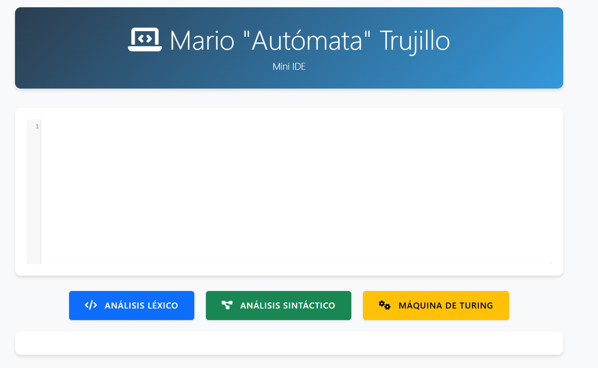

# Mini IDE - Analizador Léxico, Sintáctico y Máquina de Turing

<div align="center">
  
*IDE de lenguaje personalizado y simulador de máquina de Turing*

---
</div>

## 📚 Información del Estudiante

<table>
  <tr>
    <td><strong>Nombre:</strong></td>
    <td>Mario Gustavo Trujillo Chua</td>
  </tr>
  <tr>
    <td><strong>Materia:</strong></td>
    <td>Lenguajes y Autómatas I</td>
  </tr>
  <tr>
    <td><strong>Profesor:</strong></td>
    <td>Ing. Kevin David Molina Gomez</td>
  </tr>
  <tr>
    <td><strong>Semestre:</strong></td>
    <td>6to</td>
  </tr>
  <tr>
    <td><strong>Carrera:</strong></td>
    <td>Ingeniería en Sistemas Computacionales</td>
  </tr>
  <tr>
    <td><strong>Institución:</strong></td>
    <td>Instituto Tecnológico de Minatitlán</td>
  </tr>
</table>

## 📋 Tabla de Contenidos

- [Instalación](#-instalación)
- [Estructura del Proyecto](#-estructura-del-proyecto)
- [Lenguaje Personalizado](#-lenguaje-personalizado)
- [Máquina de Turing](#-máquina-de-turing)
- [Características](#-características)
- [Ejemplos](#-ejemplos)
- [Visualización del Proyecto](#-visualización-del-proyecto)

## 🚀 Instalación

### Requisitos Previos

- Python 3.x
- pip (gestor de paquetes de Python)

### Configuración Rápida

```bash
Clonar o descargar el proyecto

# Instalar dependencias
pip install flask

# Ejecutar el servidor
python app.py
```

Una vez ejecutado, abre tu navegador y visita `http://localhost:5000`

## 📂 Estructura del Proyecto

```
mini-ide-web/
│
├── app.py             # Servidor Flask y rutas principales
├── lexer.py           # Analizador léxico
├── parser.py          # Analizador sintáctico
├── turing.py          # Implementación de la máquina de Turing
│
├── static/            # Archivos estáticos
│   ├── logica.js      # Lógica del cliente y manejo de eventos
│   ├── estilo.css     # Estilos personalizados
│   ├── VisP.png       # Imagen de la interfaz del proyecto
│   
├── templates/         # Plantillas HTML
│   └── index.html     # Página principal del IDE
│
└── README.md          
```

### 🔧 Componentes Principales

- **app.py**: Configura el servidor Flask 
- **lexer.py**: Implementa el análisis léxico del lenguaje
- **parser.py**: Realiza el análisis sintáctico y validación de reglas
- **turing.py**: Simula la máquina de Turing para validación de cadenas
- **static/logica.js**: Maneja la interacción del usuario y actualización en tiempo real
- **static/estilo.css**: Estilos personalizados
- **static/VisP.png**: Imagen de la interfaz del proyecto
- **templates/index.html**: Define la interfaz de usuario del IDE

## 🔍 Lenguaje Personalizado

### Tokens Soportados

| Token     | Descripción             | Ejemplo    |
|-----------|------------------------|------------|
| NUMERO    | Números enteros        | `42, 123`  |
| ID        | Identificadores        | `x, hola`  |
| ASIGNAR   | Asignación            | `=`        |
| OP        | Operadores aritméticos | `+, -, *, /` |
| PAR_IZQ   | Paréntesis izquierdo  | `(`        |
| PAR_DER   | Paréntesis derecho    | `)`        |

### 📝 Gramática

```
expr → ID = expr
expr → ID OP expr
expr → NUMERO
expr → ID
expr → (expr)
```

### ⚡ Reglas Sintácticas

1. ✅ Toda variable debe tener un valor asignado
2. ❌ No se permiten operadores al inicio
3. 🔄 Los paréntesis deben estar balanceados
4. ⚠️ No se permiten operadores sueltos
5. 📝 Cada expresión debe ser válida

### 🚫 Tipos de Errores


<summary><strong>Errores Léxicos</strong></summary>

- Caracteres no reconocidos
- Símbolos inválidos


<summary><strong>Errores Sintácticos</strong></summary>

- Operadores al inicio de expresión
- Falta de asignación a variables
- Paréntesis no balanceados
- Operadores sin operandos
- Asignaciones incompletas


## 🤖 Máquina de Turing

### Especificación

La máquina acepta cadenas formadas por pares ordenados de "10" siguiendo estas reglas:

1. 📏 Longitud par obligatoria
2. 🔣 Solo símbolos '1' y '0' permitidos
3. 🔄 Cada par debe ser "10"

### Ejemplos

✅ **Cadenas Válidas**
```
10
1010
101010
```

❌ **Cadenas Inválidas**
```
1    (longitud impar)
11   (secuencia incorrecta)
100  (longitud impar)
1001 (secuencia incorrecta)
```
## 💻 Visualización del Proyecto



## 💡 Características

### Editor Inteligente

- ⚡ Análisis en tiempo real
- 🎨 Resaltado de sintaxis
- 🔍 Detección instantánea de errores
- 📝 Mensajes descriptivos

### Interfaz Moderna

- 🎯 Diseño intuitivo y responsivo
- 🔲 Botones de acción claros
- 📊 Visualización estructurada de resultados
- 💬 Mensajes de error formativos

## 📝 Ejemplos

### ✅ Código Válido

```python
x = 5
y = x + 10
resultado = (x + y) * 2
a = 42
b = a + (2 * 3)
```

### ❌ Código Inválido

```python
# Operador al inicio
+ x = 5

# Variable sin asignación
x

# Paréntesis desbalanceado
y = (x + 2

# Operador suelto
x = +

# Asignación incompleta
z = 

#Símbolos inválidos o caracteres no reconocidos
$ ñ ;
```

## 📄 Licencia

Este proyecto es para uso educativo exclusivamente

---

<div align="center">

Desarrollado por Mario Gustavo Trujillo Chua

</div> 